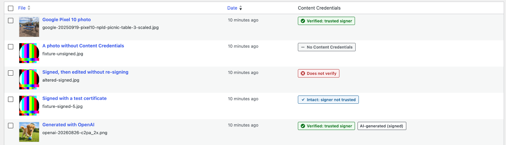
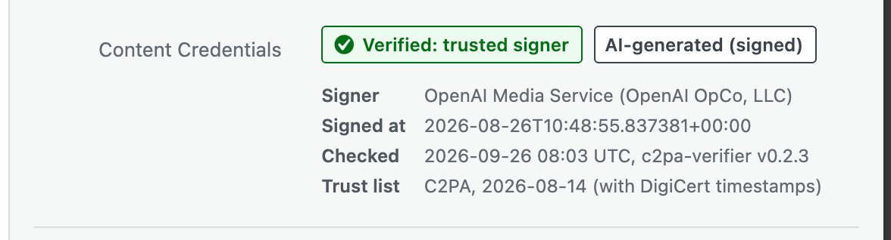
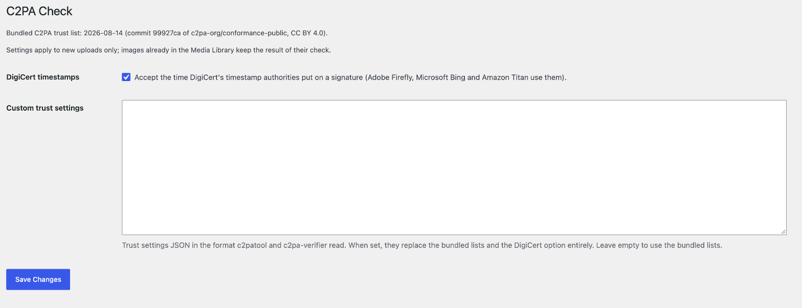

# Provemark C2PA Check

A WordPress plugin that verifies the Content Credentials (C2PA) of every
uploaded image with [provemark/c2pa-verifier](https://github.com/provemark/c2pa-verifier)
and shows the result in the Media Library. It only checks: it never signs,
never blocks an upload and makes no network calls.

Status: complete for its first scope, not released yet.

Requirements: WordPress 7.1 or later, PHP 8.3 or later with `ext-openssl`
and `ext-mbstring`.

## What it does

- Checks every JPEG, PNG and WebP upload on the original file (not the
  `-scaled` copy or any image size), also with WordPress 7.1's client-side
  media processing.
- Shows the verdict in a Media Library column and in the attachment
  details: verified (trusted signer), intact (signer not trusted), does not
  verify, no Content Credentials, or could not be checked, with the signer,
  the status codes and the trust list used.
- Shows "AI-generated (signed)" when a manifest that verifies says the
  image was made by generative AI; never on a file that does not verify.
- Trusts the C2PA conformance programme's trust lists by default (bundled,
  with their date; see [`trust/README.md`](trust/README.md)); Settings →
  C2PA Check lets an administrator replace them.
- Removes its data when the plugin is deleted.

The images in the screenshots are the test fixtures in
[`tests/Fixtures`](tests/Fixtures/README.md), with their sources and
licences.

## Building and testing

`composer check` runs Pint, PHPStan at level max and the unit tests.
`npm run env:start` starts WordPress in wp-env for `composer
test:integration`; `composer build` makes `build/provemark-c2pa-check.zip`,
and `npm run release:start` with `composer test:release` installs and
checks that zip on a clean second WordPress. The specifications are in
[`specs/`](specs/), measurements in [`notes/`](notes/), decisions in
[`NOTES.md`](NOTES.md).

This plugin is built with Claude Code; [`AI-LOG.md`](AI-LOG.md) records what
the assistant produced and what was decided by the maintainer.

## Licence

MIT, see [`LICENSE`](LICENSE). The bundled C2PA trust lists are CC BY 4.0
(see [`trust/README.md`](trust/README.md)).
